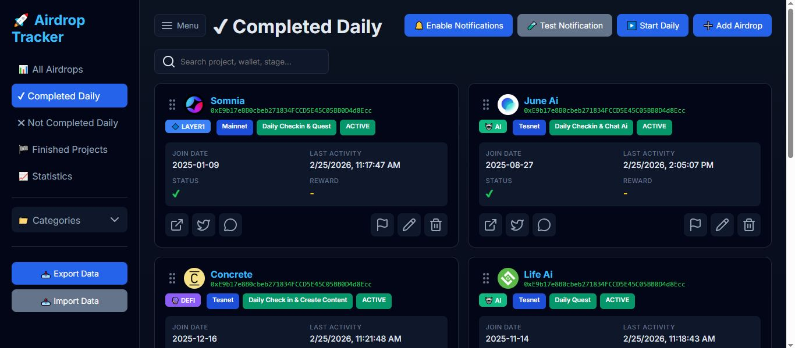
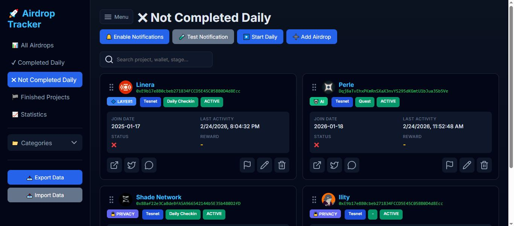
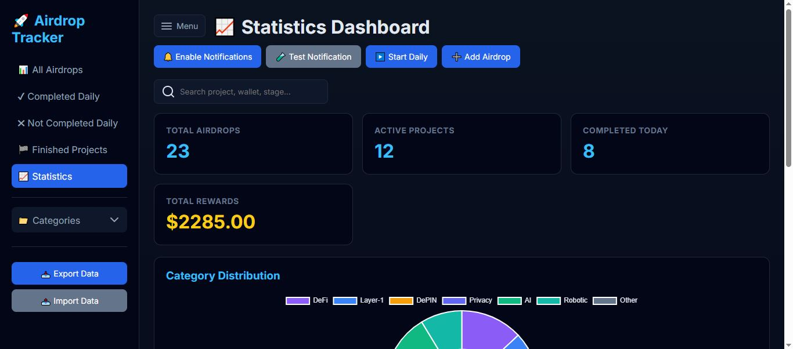

# 🚀 Airdrop Tracker

Professional airdrop management tool with drag & drop, statistics, and notifications.

## ✨ Features
- ✅ Daily Checkin
- ✅ Drag & Drop reordering
- 📊 Statistics Dashboard with charts
- 🔔 Browser notifications
- 📥 Export/Import data
- 🏷️ Categories (DeFi, Layer-1, Privacy, AI, Robotic, DePIN)
- 🔍 Real-time search & filter

## 🌐 Live Demo
[View Live](https://heisenberg-bit.github.io/airdrop-tracker-/)

## 🛠️ Usage
1. Open the app
2. Click "Add Airdrop" to start tracking
3. Enable notifications for daily reminders
4. Export your data regularly for backup

## 📸 Screenshot

